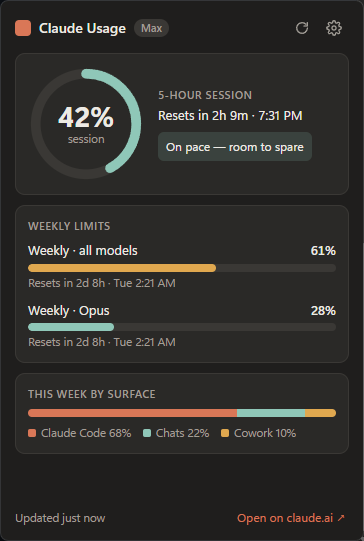
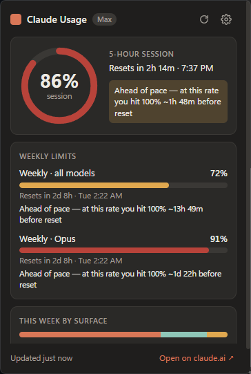
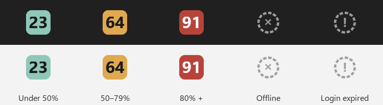
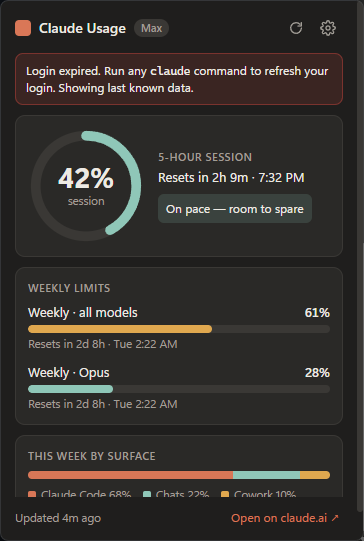
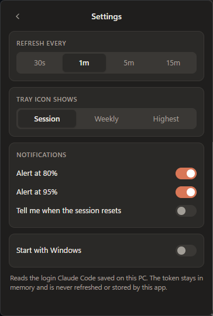

# Claude Usage Tray

**See your Claude plan usage at a glance, right in the Windows tray.**

Claude Usage Tray shows your 5-hour session limit and weekly limits without opening claude.ai. It reuses the login that [Claude Code](https://claude.com/claude-code) already saved on your PC, so there is nothing to sign in to and nothing to configure. If Claude Code works, this works.

<p align="center">
  
  &nbsp;&nbsp;
  
</p>

<p align="center">
  
</p>

> Screenshots use the built-in `--demo` data, not a real account.

---

## Contents

- [Features](#features)
- [Requirements](#requirements)
- [Install](#install)
- [Using it](#using-it)
- [Settings](#settings)
- [How it works](#how-it-works)
- [Privacy and security](#privacy-and-security)
- [Troubleshooting](#troubleshooting)
- [Development](#development)
- [Project layout](#project-layout)
- [Known limitations](#known-limitations)

---

## Features

| | |
|---|---|
| **Live tray icon** | Shows the current % as a number, colored by how close you are to the limit. |
| **Popup dashboard** | Left-click for a session ring, weekly bars, reset countdowns and a per-surface breakdown (Claude Code, Chats, Cowork, …). |
| **Pacing hint** | Compares how much you've used with how much of the window has passed, and tells you whether you'll run out before the reset. |
| **Notifications** | A Windows toast at 80% and 95%, once per reset window, plus an optional "session reset" toast. |
| **Hover tooltip** | `Session 42% · resets 6:41 PM` and `Weekly 61% · resets Tue 2:00 AM`, without clicking. |
| **Start with Windows** | One toggle, no admin rights needed. |
| **Zero setup** | Reads Claude Code's saved login. New quota types from Anthropic appear as extra bars automatically. |
| **Portable** | A single `.exe`, with no installer. |

## Requirements

- **Windows 10 or 11.** The popup uses the Edge WebView2 runtime, which is preinstalled on both.
- **Claude Code installed and logged in** with a Claude account (Pro or Max). Run `claude` once and complete the login if you haven't.

API-key-only Claude Code setups have no plan limits, so there is nothing to show.

## Install

### Option A: download the `.exe`

1. Download `ClaudeUsageTray.exe` from the [Releases](https://github.com/amrcs92/claude-usage-tray/releases) page, if a build is published there.
2. Put it anywhere (for example `%LOCALAPPDATA%\Programs\ClaudeUsageTray\`) and double-click it.
3. The `.exe` is not code-signed, so Windows SmartScreen may say **"Windows protected your PC"**. Click **More info → Run anyway**.

### Option B: build it yourself

Requires Python 3.12.

```powershell
git clone https://github.com/amrcs92/claude-usage-tray.git
cd claude-usage-tray
.\build.ps1
```

`build.ps1` creates a virtual environment, installs dependencies, runs the tests and writes `dist\ClaudeUsageTray.exe`.

If your antivirus flags the one-file build (common with PyInstaller), use a folder build instead:

```powershell
.\build.ps1 -OneDir   # dist\ClaudeUsageTray\ClaudeUsageTray.exe
```

### Option C: run from source

```powershell
py -3.12 -m venv .venv
.\.venv\Scripts\pip install -r requirements.txt
.\.venv\Scripts\pythonw app\main.py
```

## Using it

The icon appears in the notification area. If you don't see it, click the **^** arrow and drag it onto the taskbar so it stays visible.

| Action | What happens |
|---|---|
| **Hover** the icon | Tooltip with session and weekly % and reset times |
| **Left-click** the icon | Opens or closes the dashboard popup. It also closes when you click elsewhere or press <kbd>Esc</kbd>. |
| **Right-click** the icon | Menu: *Open dashboard · Refresh now · Start with Windows · Settings… · Open claude.ai usage page · Quit* |

### Reading the tray icon

| Icon | Meaning |
|---|---|
| Teal number | Under 50% used |
| Amber number | 50–79% used |
| Red number | 80% or more used |
| Grey dashed ring with **×** | Offline or the API is unreachable. The popup keeps showing the last known data. |
| Grey dashed ring with **!** | Login expired or not found. See [Troubleshooting](#troubleshooting). |

By default the number is the **session** %. You can switch it to *Weekly* or *Highest* in Settings.

### Reading the dashboard

- **Session ring**: the 5-hour rolling limit, with a countdown to the reset and the local reset time.
- **Pacing hint**:
  - *On pace — room to spare*: you've used no more than the share of the window that has passed.
  - *Ahead of pace — at this rate you hit 100% ~Xm before reset*: at your current rate you'll hit the limit before it resets. The estimate is a linear projection.
- **Weekly limits**: one bar per weekly quota (all models, plus model-specific ones such as Opus when your plan has them). Bars that are ahead of pace show the same hint.
- **This week by surface**: how your weekly usage splits across Claude Code, Chats, Cowork and so on, when Anthropic provides it.
- **Footer**: when the data was last updated, and a link to the full usage page on claude.ai.

When something is wrong, a banner at the top explains it and the last known numbers stay visible:

<p align="center">
  
</p>

## Settings

Open **Settings** from the gear icon in the popup, or with **Settings…** in the right-click menu.

<p align="center">
  
</p>

| Setting | Options | Default |
|---|---|---|
| Refresh every | 30s · 1m · 5m · 15m | 1m |
| Tray icon shows | Session · Weekly · Highest | Session |
| Alert at 80% | on / off | on |
| Alert at 95% | on / off | on |
| Tell me when the session resets | on / off | off |
| Start with Windows | on / off | off |

Settings are saved to `%APPDATA%\ClaudeUsageTray\settings.json`. You can edit the file by hand. Unknown or invalid values fall back to the defaults.

**Notification rules.** Each threshold fires at most once per reset window for each limit. If usage jumps straight past 95%, you get one toast, not two. The record of which toasts were sent is kept in `%APPDATA%\ClaudeUsageTray\notified.json`, so restarting the app doesn't repeat them.

**Start with Windows** adds a `ClaudeUsageTray` value under `HKCU\Software\Microsoft\Windows\CurrentVersion\Run`. Turning it off removes the value. If you move the `.exe`, toggle this off and on again.

## How it works

```
┌──────────────────────────┐   read fresh    ┌──────────────────────────────┐
│ %USERPROFILE%\.claude\   │ ──────────────▶ │                              │
│   .credentials.json      │  every poll     │   Claude Usage Tray          │
└──────────────────────────┘                 │                              │
                                             │  poller ──▶ tray icon        │
┌──────────────────────────┐  GET, Bearer    │     │  ──▶ popup (WebView2)  │
│ api.anthropic.com        │ ◀────────────── │     └────▶ toasts            │
│   /api/oauth/usage       │ ──────────────▶ │                              │
└──────────────────────────┘   JSON usage    └──────────────────────────────┘
```

1. **Credentials.** On every poll the app reads `.credentials.json` from `%USERPROFILE%\.claude\`, or from `%CLAUDE_CONFIG_DIR%` if you set that variable. It reads the file each time because Claude Code rewrites it whenever it refreshes the token.
2. **Usage.** It calls `GET https://api.anthropic.com/api/oauth/usage`, the same source Claude Code's `/usage` command uses.
3. **Parsing.** The response is parsed defensively in one place ([`app/usage_api.py`](app/usage_api.py)):
   - `five_hour` → session, `seven_day` → weekly (all models), and any `seven_day_*` object → an extra weekly bar
   - the newer `limits: [...]` array, which takes priority when both are present
   - `seven_day_breakdown.rows` → the per-surface breakdown
   - `null` values and unrecognised keys are skipped
4. **Polling.** It polls every minute by default, with ±5 s of jitter. On a 429, a 5xx or a network error it backs off exponentially (1 → 2 → 4 … up to 15 min). Manual refresh is limited to once every 10 s.

## Privacy and security

- **Read-only token use.** The OAuth token is read from disk, held in memory and sent only to `api.anthropic.com`. It is never logged, never written anywhere and never shown in the UI.
- **No token refresh.** The app deliberately never calls the refresh endpoint. Refreshing would rotate the refresh token and could log Claude Code out. When the token expires, the app asks you to run any `claude` command, and Claude Code refreshes it.
- **One network destination.** The only request the app makes is the usage call above. There is no telemetry and no update check. *Open on claude.ai* just opens your browser.
- **Local files only.** `settings.json` and `notified.json` hold no account data.

## Troubleshooting

<details>
<summary><b>The icon shows a grey <code>!</code> / "Login expired"</b></summary>

Your Claude Code access token has expired. Run any Claude Code command, for example:

```powershell
claude -p "hi"
```

Claude Code refreshes the token, and the tray picks it up on the next poll. You can also click **Refresh now**.
</details>

<details>
<summary><b>"Claude Code login not found"</b></summary>

- Make sure you've run `claude` and logged in with a Claude account, not only an API key.
- If you moved Claude Code's config folder, set `CLAUDE_CONFIG_DIR` to that folder for your user account, then restart the app.
</details>

<details>
<summary><b>The icon shows a grey <code>×</code> / "Offline"</b></summary>

The app can't reach `api.anthropic.com`. Check your connection, VPN or proxy. The app retries with backoff and recovers on its own. The popup keeps showing the last good numbers with "Updated Xm ago".
</details>

<details>
<summary><b>I can't see the tray icon</b></summary>

Windows hides new tray icons by default. Click the **^** arrow in the taskbar and drag *Claude Usage* onto the taskbar, or go to **Settings → Personalization → Taskbar → Other system tray icons** and turn it on.
</details>

<details>
<summary><b>The popup is blank or doesn't open</b></summary>

The popup needs the Microsoft Edge WebView2 runtime. It ships with Windows 10 and 11, but if it was removed, install the *Evergreen Runtime* from Microsoft's WebView2 page.
</details>

<details>
<summary><b>Windows says "Windows protected your PC" or my antivirus flags the .exe</b></summary>

The `.exe` is unsigned, and PyInstaller one-file builds are sometimes flagged by heuristics. Click **More info → Run anyway**, use the `-OneDir` build, or run from source.
</details>

<details>
<summary><b>The numbers differ from claude.ai</b></summary>

They should match within one poll interval. Click **Refresh now**, or lower *Refresh every* in Settings. The usage endpoint is undocumented, so if the numbers stay wrong the response shape may have changed. Please open an issue.
</details>

## Development

```powershell
py -3.12 -m venv .venv
.\.venv\Scripts\pip install -r requirements-dev.txt
.\.venv\Scripts\python -m pytest -q
```

### Command-line options

```text
python app\main.py [--demo [normal|high|expired|offline]] [--show [dashboard|settings]] [--pin]
```

| Option | Purpose |
|---|---|
| `--demo [scenario]` | Uses synthetic data instead of your account. Makes no network calls and saves no settings. |
| `--show [view]` | Opens the popup at launch, on the dashboard or the settings view. |
| `--pin` | Keeps the popup open when it loses focus. Useful for UI work and screenshots. |

For UI work, run `python app\main.py --demo high --show --pin` and edit `app/ui/*`. Restart the app to reload.

### Regenerating assets

```powershell
.\.venv\Scripts\python tools\make_icon.py     # assets\icon.ico
.\.venv\Scripts\python tools\screenshots.py   # docs\screenshots\*.png (uses --demo)
```

`screenshots.py` opens the popup for each demo scenario and captures just that window. Keep the bottom-right corner of your main screen uncovered while it runs.

### Tests

The tests in [`tests/test_usage_parse.py`](tests/test_usage_parse.py) cover response parsing (including malformed input), pacing, tray metric selection, notification dedupe, settings migration and credential handling. They run against [`tests/fixtures/usage_sample.json`](tests/fixtures/usage_sample.json), a **synthetic** response with the same shape as the real endpoint. Never commit a real API response or credentials.

### Tech stack

Python 3.12 · [pystray](https://github.com/moses-palmer/pystray) + [Pillow](https://python-pillow.org/) for the tray · [pywebview](https://pywebview.flowrl.com/) (Edge WebView2) for the popup · [httpx](https://www.python-httpx.org/) · [win11toast](https://github.com/GitHub30/win11toast) · [PyInstaller](https://pyinstaller.org/) for packaging.

## Project layout

```
app/
  main.py         entry point: wires tray, poller and popup; CLI options
  credentials.py  reads the Claude Code login (read-only)
  usage_api.py    fetches and parses the usage endpoint (the only place that knows its shape)
  model.py        UsageSnapshot / Limit dataclasses and pacing maths
  tray.py         icon rendering, tooltip text, right-click menu
  popup.py        pywebview window, positioning, JS bridge
  notifier.py     threshold / reset toasts with per-window dedupe
  settings.py     settings.json load/save with safe defaults
  autostart.py    HKCU Run key toggle
  demo.py         synthetic data for --demo
  ui/             popup HTML / CSS / JS
assets/icon.ico   app icon (generated by tools/make_icon.py)
docs/
  PLAN.md         implementation plan
  screenshots/    README images (generated by tools/screenshots.py)
tests/            pytest suite + synthetic fixture
tools/            icon and screenshot generators
build.ps1         PyInstaller build script
```

## Known limitations

- **Undocumented endpoint.** `/api/oauth/usage` is not a public API and may change or disappear. Parsing is isolated so a fix is small. If it breaks, *Open on claude.ai* still works.
- **Windows only.** The app relies on the tray, WebView2, toasts and the registry.
- **One account.** It shows whichever account Claude Code is logged into.
- **Memory use.** The WebView2 popup costs more RAM than a native window would. The popup is created once and hidden rather than destroyed, so it opens instantly.
